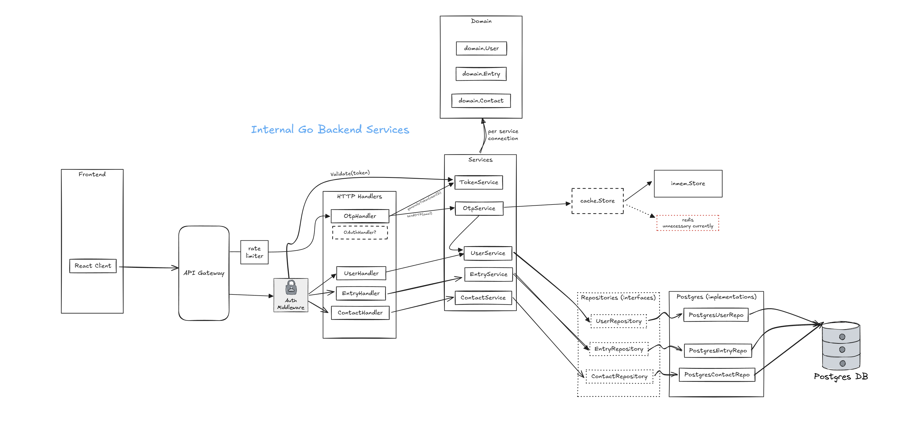

# MyPracticum

A full-stack platform for psychotherapy training programs—such as Temurot School for Psychotherapy—to manage students’ practical hours.

* Students log sessions with clients, mentors, or therapists.
* Administrators and Mentors review and approve logged hours.
* Generate comprehensive progress reports.

---

## 📊 Recent Update - Backend Architecture

<h3 align="center">Current Clean Architecture</h3>

  

---

## 🚀 Features

- **User lookup** by Email → internal UUID  
- **Contacts CRUD** (clients, mentors, therapists) with type-and-specialty validation  
- **Entries CRUD** on a calendar UI with optimistic updates  
- **Authentication & OTP**: JWT-based login plus email-delivered one-time passwords  
- **Signature capture**: users draw a personal signature JPEG on first login, shown in the top-left corner of the UI  
- **Approval workflow** (coming soon): email mentors to approve hours  
- **Dashboard & reporting** (planned): see who’s behind, export CSV/PDF  

---

## 🔒 Security & Configuration

- **Environment**: `.env` file for secrets and local overrides  
- **Defaults**: `config.yaml` for sensible, version-controlled settings  
- **Rate limiting**:  
  - Global IP-based limiter on all OTP endpoints (default 1 req/3 s, YAML-configurable)  
  - Per-email send limiter with a longer window for actual OTP deliveries  

---

## 🛠 Backend

Built in Go with Gin and PostgreSQL, following a layered architecture:

- **Domain**: pure types & validation (`Entry`, `Contact`, helpers)  
- **Repository**: interfaces + Postgres implementations (context-aware SQL)  
- **Service**: use-case orchestration (business rules, validation, flows)  
- **Handler**: thin HTTP layer (Gin binds → calls services → JSON)  
- **Middleware**: CORS + AuthMiddleware (resolves `studentId` → `userID`)  

## 🔜 Roadmap

1. **Mentor approvals** via email links - DONE, mentor page now available
2. **Admin dashboard** for progress reports & late-hour alerts - DONE, Live Google sheets for this data
3. **Notifications** (email/SMS reminders) - 
4. **Automated tests** (unit, integration, handler)

<small>© 2025 MyPracticum — built with clean‐architecture principles for maintainability and testability.</small>

